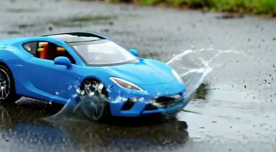

# H3 Lite

<p align="center">
  
</p>

<p align="center">
  
  
  
</p>

<p align="center">中文 | <a href="README.en.md">English</a> | <a href="#参考资料">参考资料</a></p>

`H3 Lite` 是给 Codex、WorkBuddy 等 AI Agent 使用的 MiniMax H3 本地视频生成 Skill。描述想看的画面后，Agent 会根据电脑配置选择 ComfyUI 路线、准备组件、生成带原生声音的视频并检查结果。

## 模型定位与适用范围

H3 Lite 面向 Windows + NVIDIA + ComfyUI 的低显存本地视频生成。Set A 使用 W4A8 扩散模型和 4B INT4 文本编码器，Set B 使用 4B FP8 文本编码器；两套组件分别对应低显存快速路线和 FP8 兼容路线。

当前已验证的主路线是 **Windows + NVIDIA + ComfyUI**：

| 平台 | 支持状态 | 指导 |
|---|---|---|
| Windows + NVIDIA | 主支持路线 | 使用本仓库的 ComfyUI、doctor、planner 和 fastpath。 |
| macOS Apple Silicon | 社区路线 | 可参考 MLX/Metal 的 `mmh3turbo`。 |
| macOS Intel | 未验证 | 使用托管/API 或其他后端。 |
| Linux + NVIDIA | 实验路线 | 需自行适配路径、节点和运行参数。 |

Mac 社区路线可参考[社区权重包](https://huggingface.co/yunfengwang/mmh3turbo-bundles)和 `uvx mmh3turbo`，与本 Skill 的 ComfyUI 组件分开使用。

## 从需求到成片：四步工作流

复杂视频按“**意图路由 → 参考图锚点 → 提示词增强 → 生成与验收**”处理。

| 你的目标 | 优先路线 | 关键做法 |
|---|---|---|
| 纯文字描述完整视频 | `T2VA` | 先写开场状态，再按时间顺序写动作、镜头和声音。 |
| 指定视频第一帧 | `I2VA` | 把参考图锁定在 `0.00s`，只描述后续变化。 |
| 指定首尾画面 | `FL2VA` | 描述两个锚点之间连续、可见的变化。 |
| 多张图/视频/音频参考 | `Ref2VA` | 先定义每份素材的角色、保留项和可变项，再写分镜。 |

人物或多镜头任务先建立锚点卡，固定角色、服装、道具、场景和光线，并为参考素材使用稳定名称，如 `Subject A`、`Picture 1`。若 Ref2VA 组件不完整，Agent 会改用 I2VA 或标记为实验路线。

运行时会把锚点卡保存为 `anchors.json`，并在 `manifest.json` 记录路径。`anchor_qa` 用首/中/尾帧检查画面连续性，身份、服饰和构图仍需人工复核。

提示词按“意图 → 场景与角色 → 动作与分镜 → 运镜与声音 → 防漂移约束”增强，最后转换为 H3 的 `integrated_multimodal_description`、`overall_soundscape`、`non_diegetic_music` 字段。

模糊需求可参考 [`references/prompt-assist.md`](references/prompt-assist.md) 补齐场景、动作、运镜和声音。

## 作品展示

下面六条视频使用同一提示词、Set A 组件和 `640×352 / 4 步 / 原生音频`，用于对比加速节点组合。点击海报播放。

<table>
  <tr>
    <td align="center" width="33%">
      <a href="https://rimagination.github.io/h3lite/?video=seta-lightx2v-compat">
        
      </a><br>
      <strong>兼容基线</strong><br>
      640×352 · 5 秒 · 原生音频
    </td>
    <td align="center" width="33%">
      <a href="https://rimagination.github.io/h3lite/?video=seta-lightx2v-sage">
        
      </a><br>
      <strong>仅 Sage</strong><br>
      640×352 · 5 秒 · 原生音频
    </td>
    <td align="center" width="33%">
      <a href="https://rimagination.github.io/h3lite/?video=seta-lightx2v-ffn">
        
      </a><br>
      <strong>仅 FFN</strong><br>
      640×352 · 5 秒 · 原生音频
    </td>
  </tr>
  <tr>
    <td align="center" width="33%">
      <a href="https://rimagination.github.io/h3lite/?video=seta-lightx2v-blockcache">
        
      </a><br>
      <strong>仅 Block Cache</strong><br>
      640×352 · 5 秒 · 原生音频
    </td>
    <td align="center" width="33%">
      <a href="https://rimagination.github.io/h3lite/?video=seta-lightx2v-sol">
        
      </a><br>
      <strong>仅 Sol</strong><br>
      640×352 · 5 秒 · 原生音频
    </td>
    <td align="center" width="33%">
      <a href="https://rimagination.github.io/h3lite/?video=seta-lightx2v-all-accel">
        
      </a><br>
      <strong>全加速</strong><br>
      Sage + Sol + FFN + Block Cache
    </td>
  </tr>
</table>

### 既有生成案例

红球、金毛和星舰案例覆盖动作验证、分段提示和复杂时序。

<table>
  <tr>
    <td align="center" width="33%">
      <a href="https://rimagination.github.io/h3lite/?video=case-red-ball">
        
      </a><br>
      <strong>红球弹跳</strong><br>
      动作与声音验证 · 5 秒
    </td>
    <td align="center" width="33%">
      <a href="https://rimagination.github.io/h3lite/?video=case-golden-retriever">
        
      </a><br>
      <strong>金毛幼犬醒来</strong><br>
      分段提示 · 5 秒
    </td>
    <td align="center" width="33%">
      <a href="https://rimagination.github.io/h3lite/?video=case-starship-jump">
        
      </a><br>
      <strong>星舰跃迁</strong><br>
      复杂时序与转场 · 8 秒
    </td>
  </tr>
</table>

展示页使用 GitHub Release 中的 MP4 和仓库内海报。

## 快速开始

把下面这句话发给 Codex 或 WorkBuddy：

```text
请帮我安装 H3 Lite，并根据我的电脑配置准备本地 MiniMax H3 视频生成环境：
https://github.com/Rimagination/h3lite
```

如果不想占用系统盘，把目标位置写进同一条消息：

```text
请把 MiniMax H3 和 ComfyUI 安装到 F:\MiniMax-H3；如果那里已经有健康环境就直接复用。
```

首次安装时间取决于模型大小、网络和硬盘速度。

## 硬件与路线选择

主支持配置为 Windows + NVIDIA。显存、系统内存、pagefile、磁盘和笔记本功耗都会影响速度。

| 已验证电脑 | GPU | 内存 | 路线 |
|---|---|---|---|
| 机械革命翼龙 15 Pro | RTX 4070 Laptop 8 GB | Ryzen 7 8845H / 32 GB | `LOW_VRAM`；Set A T2VA/I2VA，Set B 兼容 T2VA |
| Windows 10 台式机 | RTX 4060 Ti 16 GB | i5-13400F / 32 GB | Set B；`NORMAL_VRAM`；T2VA/I2VA |

同一套 Set B、兼容工作流、提示词、seed 和 `640×352 / 4 步` 参数下，RTX 4060 Ti 16 GB 约 77.08 秒，RTX 4070 Laptop 8 GB 约 591.22 秒。

默认使用 `fast`：4 步、原生音频、640×352。需要更高画质时使用 `balanced`（6 步）或 `quality`（8 步）。

### 常见视频分辨率

分辨率使用 32 的倍数。不指定时默认 **640×352**；`864×480` 是 16:9、约 0.4 MP 的常用质量档。

| 预设用途 | 实际分辨率 | MP |
|---|---:|---:|
| 6 GB/8 GB 低显存预览 | 608×352 | 0.21 |
| H3 Lite 默认快速路线 | 640×352 | 0.23 |
| 复杂动作实验档 | 736×416 | 0.31 |
| 约 480p、16:9 | 864×480 | 0.41 |
| 约 704p、16:9 | 1216×704 | 0.86 |
| 约 720p、16:9 | 1280×704 | 0.90 |
| 约 768p、16:9 | 1376×768 | 1.06 |
| 约 1080p、16:9 | 1920×1056 | 2.03 |

高分辨率或多镜头任务先用低分辨率预览，再提升画布。

## 安装与组件

### 先确定安装位置

| 方式 | 位置 | 适合情况 |
|---|---|---|
| 复用现有环境 | 已有 `<ComfyUI>` | 保留现有模型和节点 |
| 独立目录 | 如 `F:\MiniMax-H3\ComfyUI` | 推荐，避免占用系统盘或污染项目 |
| 当前项目 | `<项目>\.h3lite\ComfyUI` | 环境随项目保存 |

下载前先确定 ComfyUI、模型、节点和输出目录。

### 只选择一套组件

Set A 与 Set B 各自包含匹配的模型、节点、工作流和清单，选择一套即可：

| 组件集 | 已验证起点 | 分享链接 | 提取码 |
|---|---|---|---|
| Set A | RTX 4070 Laptop 8 GB + 32 GB，低显存快速路线 | [百度网盘](https://pan.baidu.com/s/1IBlH0VY7tWGvxqMtniraow) | `4hri` |
| Set B | RTX 4060 Ti 16 GB + 32 GB，FP8 兼容路线；T2VA 也在 RTX 4070 Laptop 8 GB 上验证 | [百度网盘](https://pan.baidu.com/s/1x5GGuJv0h8chApgVoDgIaQ) | `1hjx` |

将包内 `models` 和 `custom_nodes` 合并到 `<ComfyUI>`，导入工作流 JSON，并保留 `component-manifest.json`。上游文件清单见 [`references/component-sets.md`](references/component-sets.md)。

**Ref2VA 使用同一组件集。** 多图工作流复用 W4A8、文本编码器、ClipProj、双 VAE 和 Turbo LoRA。

### 手动安装 Skill

打开仓库页面，选择 **Code → Download ZIP**。解压后把 `h3lite` 文件夹放入 Codex 的 skills 文件夹，再重新打开 Codex。

## 第一次验证

安装完成后，先用动作简单、声音明确的 5 秒视频检查整条链路：

```text
请使用 H3 Lite，生成一个 5 秒横屏视频：一颗小型哑光红色橡胶球，在灰色混凝土地面上弹跳两次，然后向右滚出画面。低机位固定镜头，阴冷的多云日光，浅景深、35mm 电影质感；保留两次撞击地面的声音和滚动声，不配音乐。
```

[](assets/examples/h3lite-red-ball-and-plant.mp4)

点击封面播放或下载视频。

检查视频、动作、画面运动和原生声音，确认后再提高画布或复杂度。

## 提示词与案例

短视频提示词按三部分组织：

1. **画面与氛围**：主体、环境、光线、景别和风格。
2. **动作与镜头**：按播放顺序描述动作和运镜。
3. **声音**：环境声、动作声、音乐或对白。

“不要对白”保留环境声和动作声；“完全静音”才关闭音频。中文提示词补充主体、环境、镜头、光线和动作。

### 模糊需求的提示词辅助

模糊需求先补齐主体、动作、运镜和声音；写作模板见 [`references/prompt-assist.md`](references/prompt-assist.md)。

### 分段提示：金毛幼犬醒来

```text
请使用 H3 Lite 生成一个 5 秒视频：

[0s-2s] 一只金毛幼犬蜷缩着睡在洒满阳光的木地板上，晨光透过窗户倾泻而入，尘埃微粒在空气中漂浮。

[2s-5s] 幼犬慢慢醒来，前爪向前伸展，打了个带着细小吱声的哈欠，然后坐起身，用明亮好奇的眼睛环顾四周，尾巴开始摇晃。
```

[](assets/examples/h3lite-golden-retriever-puppy.mp4)

点击封面播放或下载视频。

### 文生视频：星舰跃迁

这个 8 秒 T2VA 案例化用自 MiniMax H3 官方可复现案例，适合观察复杂时序、转场和声音设计：

```text
请使用 H3 Lite，生成一个 8 秒 16:9 视频：昏暗而宽阔的星舰舰桥内，一位短发女舰长背对镜头站在弧形观察窗前，窗外的深紫色星云中排列着庞大的黑色舰队。镜头先缓慢推近，舰队尾部的蓝色引擎逐渐增强；约 3.5 秒时切到舰长面部特写，舰队突然跃迁，强烈白光淹没舰桥，冲击使镜头剧烈震动，舰长踉跄后重新站稳。白光消退，窗外只剩空旷星云，她缓缓闭上眼睛。保留舰桥低沉嗡鸣、引擎蓄能声、跃迁爆响和金属震动声，配以逐渐增强的太空歌剧管弦乐。
```

[](assets/examples/h3lite-starship-jump.mp4)

点击封面播放或下载视频。

### 图生视频：恶搞之家式客厅换台

下载或直接附上[示例首帧](assets/examples/h3lite-i2va-familyguy-first-frame.png)，并明确指定它为视频第一帧。这个案例使用原创角色和原创场景，保留美式成人动画的粗黑轮廓、平涂色彩与夸张表情，展示 I2VA 如何在保持人物、服装和客厅构图的同时推进连续动作。


当前示例：`864×480 · 5 秒 · 8 步 · Set A 兼容路线 · 原生音频`。

```text
请使用 H3 Lite，将我在这条消息中附上的图片作为视频 0 秒的第一帧，生成一个 5 秒横屏视频。保持原创美式成人动画风格、四位家庭成员、服装、客厅布局、电视位置、粗黑轮廓、平涂色彩和中广角固定构图。父亲突然前倾，用遥控器对着电视换台；母亲抱臂翻白眼；儿子和女儿转向父亲，露出夸张的不耐烦表情。电视光轻微闪烁，爆米花碗轻轻晃动；结尾父亲得意地指着电视，其他人一起盯着他。保留电视环境声、遥控器按键声、沙发摩擦声、爆米花碗轻响和短促的非语言反应，配轻快的情景喜剧音乐，不要清晰对白。
```

[](assets/examples/h3lite-i2va-familyguy-scene-864x480-8step.mp4)

点击封面播放或下载视频。

### Ref2VA：视频与声音参考

下载 MiniMax 官方案例的[参考视频](assets/examples/minimax-official-ref2va-pink-suit-black-lamb.mp4)和[男声音色参考](assets/examples/minimax-official-ref2va-voice-reference.mp3)，分别指定画面、动作、声音和对白的参考来源。

多镜头任务先用低分辨率跑完整分镜，再提升画布；长任务保留每个镜头的日志。

### Ref2VA：多张图片参考

把图片按提示词中的顺序重复附加为 `Picture 1`、`Picture 2`、`Picture 3`。建议一张主图负责人物身份，其余图片分别负责场景、服装/道具或姿势；不要让每张图片都要求“完整复制”。对应的命令形式是：

```powershell
python scripts/h3_fastpath.py `
  --comfyui F:\MiniMax-H3\ComfyUI `
  --prompt-file prompts/ref2va.txt `
  --ref-image identity.png `
  --ref-image scene.png `
  --ref-image wardrobe.png `
  --mode ref2va `
  --resolution 640x352 `
  --profile fast `
  --json
```

当前 Ref2VA 模板使用 ClipProj `resident` 模式，显存占用高于 I2VA。提示词和角色分配见 [`references/prompt-writing.md`](references/prompt-writing.md) 与 [`references/agent-workflow.md`](references/agent-workflow.md)。

底层 `MiniMaxH3ReferenceToVideo` 也支持参考视频和音频，可通过原生工作流接入。

## 不打开网页也能看进度

Windows 上运行 fastpath 时会弹出原生进度窗口，显示：

- 显示排队、采样、解码、写入视频等阶段；
- 直接读取 ComfyUI 原生 WebSocket 的步骤和节点进度；
- 同时显示已用时间、预计剩余时间、显存、内存和 pagefile；
- 输出路径和任务状态。

窗口读取 ComfyUI 的 WebSocket 节点进度，并显示节点阶段、采样步骤、耗时、ETA、显存、内存、pagefile 和输出路径。默认大小 `760×620`，内容区带滚动条。节点完成度是结构进度，ETA 使用实测耗时估计。终端-only 运行加 `--no-monitor-gui`。

窗口直接连接 ComfyUI，关闭窗口不会中断生成。也可以独立打开：

```powershell
python scripts/h3_monitor_gui.py `
  --comfyui F:\MiniMax-H3\ComfyUI
```

没有任务时显示等待状态；`--once --no-websocket` 可用于诊断。

## 组件完整性与故障排查

H3 Lite 将扩散模型、文本编码器、ClipProj、Turbo LoRA、双 VAE、工作流和节点版本作为一套组件管理。Set B 的关键文件首次使用或发生变化时校验 SHA-256，并缓存结果。

排查顺序：磁盘/pagefile → 模型和节点 → 模型路径/文件名 → CUDA/PyTorch/custom node → OOM/CPU 卸载 → H3 音视频流程 → 提示词和参考素材。灰屏或马赛克优先检查权重、VAE、sigma-shift 和可选补丁。

## 参考资料

- [MiniMax H3 ComfyUI 教程](https://docs.comfy.org/tutorials/video/minimax/minimax-h3)
- [MiniMax-H3 官方仓库](https://github.com/MiniMax-AI/MiniMax-H3)
- [H3 prompt-writing skill](https://github.com/MiniMax-AI/MiniMax-H3/tree/main/skills/h3-prompt-writing)
- [Agent 工作流参考：路由、锚点、提示词增强与验收](references/agent-workflow.md)
- [Higgsfield 公开 Agent Skills（设计参考）](https://github.com/higgsfield-ai/skills)
- [Higgsfield 提示词模板与生成器（提示词辅助）](references/prompt-assist.md)
- [社区 Mac/Metal MLX 移植实录](https://zhuanlan.zhihu.com/p/2069479566171812707)
- [社区 Apple Silicon 本地部署排错实录](https://mp.weixin.qq.com/s/hN60KLN7Pkpqb0pbk-r4WQ)
- [完整组件集与校验值](references/component-sets.md)
- [硬件、分辨率与部署矩阵](references/deployment-matrix.md)

## License

H3 Lite 使用 MIT License。MiniMax 模型权重、ComfyUI、第三方 custom nodes 和上游资料分别遵循各自许可证。
