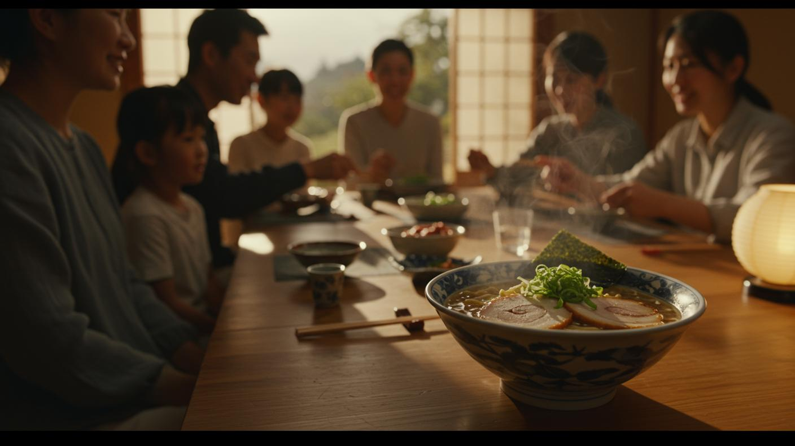

# H3 Lite

<p align="center">
  
</p>

<p align="center">
  
  
  
</p>

<p align="center">
  <a href="#zh-cn">中文</a> | <a href="#english">English</a> | <a href="#references--参考资料">References / 参考资料</a>
</p>

<a id="zh-cn"></a>
## 中文

`H3 Lite` 是一个给 Codex 使用的 MiniMax H3 本地视频生成 skill。你只需要用自然语言描述想看的画面，它会根据电脑配置选择 ComfyUI 路线，准备必要组件，生成短视频并验证结果。

### 一分钟开始

不需要打开命令行，也不需要先学习 Python、ComfyUI 或模型安装。把下面这句话发给 Codex：

```text
请帮我安装这个 skill，并根据我的电脑配置准备本地 MiniMax H3 视频生成环境：
https://github.com/Rimagination/h3lite
```

如果需要指定安装位置，可以继续说：

```text
请把 ComfyUI 放在 F:\MiniMax-H3\ComfyUI；如果那里已经是健康的安装，就直接复用。
```

也可以说：

```text
请把安装放在当前项目中。
```

不想使用 agent 时，可以打开 [H3 Lite repository](https://github.com/Rimagination/h3lite)，选择 **Code → Download ZIP**，解压后把 `h3lite` 文件夹放入 Codex 的 skills 文件夹，再重新打开 Codex。

### 快速验证

**案例 1 · 红球弹跳**

安装完成后，可以先用这个简单案例快速验证视频与声音生成：

```text
请使用 H3 Lite，生成一个 5 秒横屏视频：一颗小型哑光红色橡胶球，在灰色混凝土地面上弹跳两次，然后向右滚出画面。低机位固定镜头，阴冷的多云日光，浅景深、35mm 电影质感；保留两次撞击地面的声音和滚动声，不配音乐。
```

**案例 2 · 金毛幼犬醒来（分段提示）**

连续动作按时间分段，通常能让模型更好地遵循动作顺序：

```text
使用 H3 Lite 生成一个 5 秒横屏视频：

[0s-2s] 一只金毛幼犬蜷缩着睡在洒满阳光的木地板上，晨光透过窗户倾泻而入，尘埃微粒在空气中漂浮。

[2s-5s] 幼犬慢慢醒来，前爪向前伸展，打了个带着细小吱声的哈欠，然后坐起身，用明亮好奇的眼睛环顾四周，尾巴开始摇晃。
```

不需要自己填写模型名称、节点名称、采样步数或 ComfyUI 工作流。`H3 Lite` 会根据电脑和要求决定这些细节。

### 以规范的提示词生成视频

下面三个想法化用自 MiniMax H3 的[可复现 768p 案例](https://github.com/MiniMax-AI/MiniMax-H3#reproducible-768p-cases)。直接把自然语言提示词交给 H3 Lite 即可；实际分辨率会根据电脑配置和你的明确要求决定。

#### 三段式提示案例

规范的短视频提示词可以按三段式来写：

1. **画面与氛围**：主体在哪里，光线、景别和风格是什么。
2. **动作与镜头**：主体发生什么变化，镜头怎样运动。
3. **声音**：环境声、动作声、音乐或对白；“不要对白”不等于静音。

**星舰跃迁（T2VA，8 秒）**

```text
请使用 H3 Lite，生成一个 8 秒 16:9 视频：昏暗而宽阔的星舰舰桥内，一位短发女舰长背对镜头站在弧形观察窗前，窗外的深紫色星云中排列着庞大的黑色舰队。镜头先缓慢推近，舰队尾部的蓝色引擎逐渐增强；约 3.5 秒时切到舰长面部特写，舰队突然跃迁，强烈白光淹没舰桥，冲击使镜头剧烈震动，舰长踉跄后重新站稳。白光消退，窗外只剩空旷星云，她缓缓闭上眼睛。保留舰桥低沉嗡鸣、引擎蓄能声、跃迁爆响和金属震动声，配以逐渐增强的太空歌剧管弦乐。
```

#### 图生视频

**拉面与家宴（I2VA，8 秒）**

先下载或直接附上 MiniMax 官方案例的[拉面首帧图](assets/examples/minimax-official-i2va-ramen-first-frame.png)，明确将它指定为视频第一帧，然后发送：



```text
请使用 H3 Lite，将我在这条消息中附上的图片作为视频 0 秒的第一帧，生成一个 8 秒视频，并保持图片中的人物、拉面、餐桌和房间构图。镜头全程固定：开始时让前景的青花瓷拉面碗、叉烧、葱花和升腾的热气清晰可见，背景中的家人保持柔和虚化；随后平稳地把焦点从拉面转移到家人，拉面逐渐虚化，家人的笑容、夹菜和轻微交谈动作变得清晰，热气始终在前景飘动。保留汤汁轻微沸腾声、碗筷碰撞声和温暖的室内环境声，加入轻柔的原声吉他与古筝音乐，不要清晰对白。
```

#### 视频与声音参考

**粉色西装与黑羊（Ref2VA，5 秒）**

先下载 MiniMax 官方案例的[参考视频](assets/examples/minimax-official-ref2va-pink-suit-black-lamb.mp4)和[男声音色参考](assets/examples/minimax-official-ref2va-voice-reference.mp3)，再在同一条消息中附上这两份素材。参考视频已经包含原有背景音乐和环境声，单独的音频只用于参考男声音色。然后发送：

```text
请使用 H3 Lite，根据我在这条消息中附上的参考视频和男声音频生成一个 5 秒视频：以参考视频作为画面、动作和背景音轨基础，保留金发男子、亮粉色西装、怀中的黑色小羊、夕阳草地、远处白羊以及原有镜头构图；只参考单独男声音频的音色来生成新对白。男子看向镜头自然说：“跟着风，自由生活。”说完后露出轻松的微笑，望向远处，并轻轻抚摸黑羊的毛，镜头缓慢推近。人物口型与中文对白同步，其余画面保持写实自然。
```

以上素材来自 MiniMax H3 官方可复现案例的输入文件；来源 URL 和校验值记录在 [`assets/examples/sources.json`](assets/examples/sources.json)。I2VA 和 Ref2VA 需要相应的图片、视频或音频工作流；如果当前安装只有默认文本生成路线，H3 Lite 会先说明并引导配置缺少的模式。

### 默认路线和电脑要求

默认使用已经验证过的低显存 W4A8/4B fast 路线，优先保证笔记本上的成功率和速度。

| 电脑情况 | 默认建议 |
|---|---|
| NVIDIA 笔记本，约 8 GB 显存 | W4A8/4B fast，通常选择 640×352；明确指定更大画布时会提示风险 |
| 10–16 GB 显存 | fast 或 balanced，可尝试更大画布 |
| 16 GB 以上显存 | 可以尝试 balanced 或 quality，仍以实际驱动和组件为准 |
| 没有 NVIDIA CUDA GPU | 不承诺本地 H3 路线，改用远程 API 或其他后端 |

模型权重、ComfyUI 和第三方 custom nodes 不包含在仓库中。它们体积较大，并且各自有版本与许可要求；缺少组件时，Codex 会告诉你需要准备什么。

### 常见问题

**需要懂代码吗？**

不需要。普通用户只需安装 skill，然后用自然语言描述视频。

**“不要对白”是不是完全静音？**

不是。`不要对白` 只表示没有 spoken dialogue；默认仍保留雨声、脚步声、室内环境声等自然音效。需要完全静音时，请明确说“完全静音，不要对白、音乐和环境声”。

**可以自己指定分辨率吗？**

可以。H3 Lite 会提示 OOM 或耗时风险，但不会偷偷替换你明确指定的画布。

**第一次为什么可能比较慢？**

第一次运行可能需要加载模型、编译 CUDA 内核或进行低显存 CPU offload。成功运行后，H3 Lite 会记录实际耗时，用于改进下一次估计。

**没有 NVIDIA 显卡可以用吗？**

本地 CUDA 路线不承诺支持；可以改用远程 API 或其他视频生成后端。

<a id="english"></a>
## English

`H3 Lite` is a Codex skill for local MiniMax H3 video generation. Describe the video you want in plain English, and it chooses a ComfyUI route from your hardware, prepares the required components, generates the clip, and verifies the result.

### One-minute start

You do not need to open a terminal or learn Python, ComfyUI, or model installation. Send this to Codex:

```text
Please install this skill and prepare a local MiniMax H3 video-generation environment for my computer:
https://github.com/Rimagination/h3lite
```

To choose the installation location, say:

```text
Put ComfyUI at F:\MiniMax-H3\ComfyUI. Reuse it if it is already healthy.
```

### Quick validation

**Example 1 · Bouncing red ball**

After installation, start with this simple prompt to quickly validate video and audio generation:

```text
Use H3 Lite to generate a 5-second landscape video. A small matte red rubber ball bounces twice on grey concrete, then rolls out of frame to the right. Use a locked-off low-angle camera, cold overcast daylight, shallow depth of field, and a 35mm cinematic look. Keep the sounds of the ball striking the ground twice and rolling across the concrete. No music.
```

**Example 2 · Golden retriever puppy wakes up (timeline prompt)**

For consecutive actions, dividing the prompt by time usually helps the model follow the intended sequence more reliably:

```text
Use H3 Lite to generate a 5-second landscape video:

[0s-2s] A golden retriever puppy sleeps curled up on a sunlit wooden floor, morning light streaming through a window, dust motes floating in the air.

[2s-5s] The puppy slowly wakes up, stretches its front paws forward, yawns with a tiny squeak, then sits up and looks around with bright curious eyes as its tail starts wagging.
```

### Generate video with structured prompts

These prompts are adapted from MiniMax H3's [reproducible 768p cases](https://github.com/MiniMax-AI/MiniMax-H3#reproducible-768p-cases). H3 Lite chooses the actual resolution from the machine and any explicit canvas request.

#### Three-part prompt example

Use a simple three-part structure:

1. **Scene and atmosphere**: subject, setting, lighting, framing, and style.
2. **Action and camera**: what changes and how the camera moves.
3. **Sound**: ambience, action sounds, music, or dialogue; “no dialogue” does not mean silence.

**Starship jump (T2VA, 8 seconds)**

```text
Use H3 Lite to generate an 8-second 16:9 video. On the vast, dim bridge of a starship, a short-haired female captain stands with her back to the camera before a curved observation window. A massive dark fleet waits against a deep-purple nebula. The camera slowly pushes in as the fleet's blue engines intensify. At about 3.5 seconds, cut to a close-up of the captain. The fleet suddenly jumps to hyperspace; a white flash floods the bridge, the camera shakes violently, and the captain staggers before bracing herself. As the light fades, only the empty nebula remains and she slowly closes her eyes. Keep the low bridge hum, rising engine whine, hyperspace boom, and metallic vibration, with a swelling space-opera orchestral score.
```

#### Image to video

**Ramen family dinner (I2VA, 8 seconds)**

Download or directly attach MiniMax's official [ramen first frame](assets/examples/minimax-official-i2va-ramen-first-frame.png), designate it as the video's first frame, and then send:


```text
Use H3 Lite to treat the image attached to this message as the first frame at 0 seconds and generate an 8-second video while preserving its people, ramen, table, room, and composition. Keep the camera static. Begin with the blue-and-white ramen bowl, chashu, scallions, and rising steam in crisp foreground focus while the family remains softly blurred. Smoothly rack focus from the ramen to the family: the bowl softens, their smiles and small dining gestures become clear, and steam continues drifting through the foreground. Keep the quiet broth simmer, ceramic and chopstick clinks, and warm room tone. Add gentle acoustic guitar and koto music, with no intelligible dialogue.
```

#### Video and audio reference

**Pink suit and black lamb (Ref2VA, 5 seconds)**

Download MiniMax's official [reference video](assets/examples/minimax-official-ref2va-pink-suit-black-lamb.mp4) and [male voice reference](assets/examples/minimax-official-ref2va-voice-reference.mp3), then attach both in the same message. The reference video already contains its original music and ambient audio; the separate audio file is used only as a male voice-timbre reference. Then send:

```text
Use H3 Lite to generate a 5-second video from the reference video and male voice sample attached to this message. Use the reference video as the visual, motion, and background-audio foundation, preserving the blond man, bright pink suit, black lamb in his arms, golden-hour pasture, distant white lambs, and original camera composition. Use only the separate male voice sample's timbre to generate new dialogue. Looking toward the camera, he naturally says, “Follow the wind, live free.” He then smiles peacefully, looks toward the horizon, and gently strokes the lamb as the camera slowly pushes in. Keep realistic motion and synchronize his lips to the English dialogue.
```

These files are the inputs referenced by MiniMax H3's official reproducible cases; their source URLs and checksums are recorded in [`assets/examples/sources.json`](assets/examples/sources.json). I2VA and Ref2VA require the corresponding image, video, or audio workflow. If the installation only has the default text-to-video route, H3 Lite explains what is missing and guides the user through configuring that mode.

### Default route and hardware

The default is the validated low-VRAM W4A8/4B fast route, prioritizing a reliable and reasonably fast result on laptops.

| Machine | Default recommendation |
|---|---|
| NVIDIA laptop with about 8 GB VRAM | W4A8/4B fast, usually 640×352; an explicit larger canvas triggers a risk warning |
| 10–16 GB VRAM | Fast or balanced; larger canvases may be practical |
| More than 16 GB VRAM | Balanced or quality can be tested, subject to the driver and installed components |
| No NVIDIA CUDA GPU | Use a remote API or another backend instead of the local CUDA route |

Model weights, ComfyUI, and third-party custom nodes are not bundled. They are large, version-sensitive, and subject to their own licenses.

### FAQ

**Do I need to know how to code?**

No. Install the skill and describe the video in plain language.

**Does “No dialogue” mean complete silence?**

No. It removes spoken dialogue but keeps natural environmental sound by default. Ask for complete silence if you want no dialogue, music, or ambient sound.

**Can I specify a resolution?**

Yes. H3 Lite keeps an explicit canvas and gives one concise OOM or time warning.

**Why can the first run be slower?**

Models may need to load, CUDA kernels may compile, and low-VRAM CPU offload may occur. Successful runs update the empirical timing estimate.

<a id="references--参考资料"></a>
## References / 参考资料

- [MiniMax H3 ComfyUI tutorial](https://docs.comfy.org/tutorials/video/minimax/minimax-h3)
- [MiniMax-H3 repository](https://github.com/MiniMax-AI/MiniMax-H3)
- [H3 prompt-writing skill](https://github.com/MiniMax-AI/MiniMax-H3/tree/main/skills/h3-prompt-writing)
- [Good Story README structure](https://github.com/Rimagination/good-story)
- [THU Digitizer user-first installation flow](https://github.com/Rimagination/thu-digitizer)

## License

H3 Lite is released under the MIT License. MiniMax model weights, ComfyUI, third-party custom nodes, and upstream documentation remain subject to their respective licenses.
